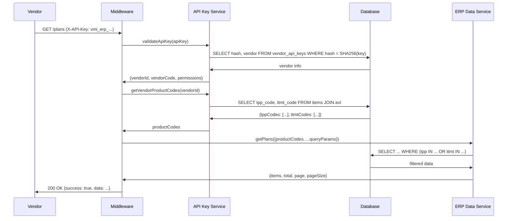

# VMI Portal - Vendor API Specification

## คู่มือการเชื่อมต่อ API สำหรับ Vendor

**เวอร์ชัน:** 1.3
**อัปเดตล่าสุด:** 25 ธันวาคม 2567

---

## สารบัญ

1. [ภาพรวม](#1-ภาพรวม)
2. [การยืนยันตัวตน (Authentication)](#2-การยืนยันตัวตน-authentication)
3. [API สำหรับซิงค์ข้อมูลสินค้า](#3-api-สำหรับซิงค์ข้อมูลสินค้า)
4. [API สำหรับซิงค์ราคาสินค้า](#4-api-สำหรับซิงค์ราคาสินค้า)
5. [API สำหรับซิงค์สต็อกสินค้า](#5-api-สำหรับซิงค์สต็อกสินค้า)
6. [API สำหรับจัดการคำสั่งซื้อ](#6-api-สำหรับจัดการคำสั่งซื้อ)
7. [รหัสข้อผิดพลาด](#7-รหัสข้อผิดพลาด)
8. [ตัวอย่างการใช้งาน](#8-ตัวอย่างการใช้งาน)
9. [API สำหรับดึงข้อมูลโรงพยาบาล (ERP Integration)](#9-api-สำหรับดึงข้อมูลโรงพยาบาล-erp-integration)

---

## 1. ภาพรวม

VMI Portal เปิดให้ Vendor สามารถส่งข้อมูลเข้าสู่ระบบผ่าน REST API โดยข้อมูลที่สามารถส่งได้ประกอบด้วย:

- **ข้อมูลสินค้า (Items)** - รายการสินค้าที่ Vendor มีจำหน่าย
- **ราคาสินค้า (Prices)** - ราคาขายและเงื่อนไขการขาย
- **สต็อกสินค้า (Inventory)** - จำนวนสินค้าคงคลังที่พร้อมจำหน่าย
- **คำสั่งซื้อ (Orders)** - รับและจัดการคำสั่งซื้อจากโรงพยาบาล

### Base URL

```
Production: https://vmi-portal.bmscloud.in.th/api/external/vendor
Development: http://localhost:3000/api/external/vendor
```

### ลำดับการส่งข้อมูล

**สำคัญ:** ต้องส่งข้อมูลตามลำดับดังนี้

```
1. Items (ข้อมูลสินค้า) → ต้องส่งก่อนเสมอ
2. Prices (ราคา) → ส่งหลังจากมีข้อมูลสินค้าแล้ว
3. Inventory (สต็อก) → ส่งหลังจากมีข้อมูลสินค้าแล้ว
4. Orders (คำสั่งซื้อ) → ตรวจสอบและจัดการคำสั่งซื้อจากโรงพยาบาล
```

### ภาพรวมการทำงานของระบบ VMI

```kroki
mermaid

flowchart TB
    subgraph Hospital["โรงพยาบาล"]
        A["จัดทำแผนจัดซื้อรายไตรมาส"] --> B["สร้างใบสั่งซื้อ<br/>เลือกสินค้าและผู้จำหน่าย VMI"]
        B --> B1["ขอตรวจสอบราคา Realtime"]
        B1 --> B4{"ยืนยันราคา?"}
        B4 -->|ไม่ยืนยัน| B
        B4 -->|ยืนยัน| C["ส่งคำสั่งซื้อเข้าระบบ VMI"]

        K["รับสินค้าจาก Vendor"] --> L["ตรวจรับสินค้า"]
        L --> M["บันทึกนำเข้าคลังสินค้า"]
        M --> N["ส่งสถานะ รับสินค้าแล้ว<br/>เข้า VMI Portal"]
    end

    subgraph VMI["VMI Portal"]
        B2["API ขอราคาสินค้า<br/>จาก Vendor"]
        B3["ส่งราคาล่าสุดกลับ รพ."]

        D[("บันทึกคำสั่งซื้อ")]
        E["แจ้งเตือน Vendor<br/>มีคำสั่งซื้อใหม่"]

        H["อัพเดทสถานะใบสั่งซื้อ"]

        O["บันทึกสถานะ<br/>รพ.รับสินค้าแล้ว"]
    end

    subgraph Vendor["Vendor Backend"]
        V1["API ส่งราคาสินค้า<br/>ล่าสุด Realtime"]

        F["เรียก API ตรวจสอบ<br/>คำสั่งซื้อใหม่"]
        G{"มีคำสั่งซื้อ?"}
        I["ยืนยันรับคำสั่งซื้อ"]
        J["จัดเตรียมและส่งสินค้า"]

        P["เรียก API ตรวจสอบ<br/>สถานะการรับสินค้า"]
        Q["ตั้งลูกหนี้การค้า"]
    end

    B1 --> B2
    B2 --> V1
    V1 --> B2
    B2 --> B3
    B3 --> B4

    C --> D
    D --> E
    E -.-> F
    F --> G
    G -->|ไม่มี| F
    G -->|มี| I
    I --> H
    H --> J
    J --> K

    N --> O
    O -.-> P
    P --> Q
```

### สถานะคำสั่งซื้อ (Order Status)

| สถานะ | คำอธิบาย | การเปลี่ยนสถานะถัดไป |
|-------|----------|----------------------|
| `draft` | โรงพยาบาลกำลังร่างคำสั่งซื้อ (ไม่แสดงให้ Vendor) | → `submitted` |
| `submitted` | โรงพยาบาลส่งคำสั่งซื้อแล้ว รอ Vendor ยืนยัน | → `confirmed` หรือ `cancelled` |
| `confirmed` | Vendor ยืนยันรับคำสั่งซื้อแล้ว | → `shipped` |
| `shipped` | Vendor จัดส่งสินค้าแล้ว | → `received` |
| `received` | โรงพยาบาลรับสินค้าแล้ว | (สถานะสุดท้าย) |
| `cancelled` | คำสั่งซื้อถูกยกเลิก | (สถานะสุดท้าย) |

> **หมายเหตุ:** คำสั่งซื้อสถานะ `draft` จะไม่แสดงผลในการค้นหาของ Vendor เนื่องจากยังอยู่ระหว่างการร่างโดยโรงพยาบาล

---

## 2. การยืนยันตัวตน (Authentication)

### API Key

ทุก Request ต้องส่ง API Key ผ่าน HTTP Header:

```
X-API-Key: YOUR_VENDOR_API_KEY
```

### การขอ API Key

ติดต่อผู้ดูแลระบบ VMI Portal เพื่อขอรับ API Key โดยจะได้รับข้อมูลดังนี้:

- **API Key** - รหัสสำหรับยืนยันตัวตน (แสดงครั้งเดียว กรุณาเก็บรักษาไว้)
- **Vendor ID** - รหัส Vendor ในระบบ

### ตัวอย่าง Header

```http
POST /api/external/vendor/items HTTP/1.1
Host: vmi-portal.bmscloud.in.th
Content-Type: application/json
X-API-Key: vmi_vend_VENDOR01_a1b2c3d4e5f6g7h8i9j0k1l2m3n4o5p6
```

---

## 3. API สำหรับซิงค์ข้อมูลสินค้า

### POST /api/external/vendor/items

ส่งข้อมูลรายการสินค้าเข้าสู่ระบบ

#### Request Body

```json
{
  "items": [
    {
      "localCode": "string (จำเป็น)",
      "tppCode": "string (ไม่บังคับ)",
      "ttmtCode": "string (ไม่บังคับ)",
      "name": "string (จำเป็น)",
      "genericName": "string (ไม่บังคับ)",
      "unit": "string (จำเป็น)",
      "packSize": "number (จำเป็น)",
      "packUnit": "string (จำเป็น)",
      "isHerbal": "boolean (ไม่บังคับ)",
      "category": "string (ไม่บังคับ)",
      "isActive": "boolean (ไม่บังคับ)"
    }
  ]
}
```

#### รายละเอียดฟิลด์

| ฟิลด์ | ประเภท | จำเป็น | ความยาวสูงสุด | คำอธิบาย |
|-------|--------|--------|---------------|----------|
| `localCode` | string | ใช่ | 50 | รหัสสินค้าภายในของ Vendor (ต้องไม่ซ้ำ) |
| `tppCode` | string | ไม่ | 50 | รหัส TPP (Thai Pharmaceutical Product) |
| `ttmtCode` | string | ไม่ | 10 | รหัส TTMT |
| `name` | string | ใช่ | 500 | ชื่อสินค้า |
| `genericName` | string | ไม่ | 500 | ชื่อสามัญทางยา |
| `unit` | string | ใช่ | 50 | หน่วยนับ เช่น tablet, capsule, ml |
| `packSize` | number | ใช่ | - | จำนวนต่อแพ็ค (ค่าเริ่มต้น: 1) |
| `packUnit` | string | ใช่ | 50 | หน่วยแพ็ค เช่น box, bottle, strip |
| `isHerbal` | boolean | ไม่ | - | เป็นผลิตภัณฑ์สมุนไพรหรือไม่ (ค่าเริ่มต้น: false) |
| `category` | string | ไม่ | 100 | หมวดหมู่สินค้า |
| `isActive` | boolean | ไม่ | - | สถานะใช้งาน (ค่าเริ่มต้น: true) |

#### ตัวอย่าง Request

```bash
curl -X POST https://vmi-portal.bmscloud.in.th/api/external/vendor/items \
  -H "Content-Type: application/json" \
  -H "X-API-Key: YOUR_VENDOR_API_KEY" \
  -d '{
    "items": [
      {
        "localCode": "MED-001",
        "tppCode": "1100010001000",
        "ttmtCode": "A01234567",
        "name": "พาราเซตามอล 500 มก. เม็ด",
        "genericName": "Paracetamol",
        "unit": "เม็ด",
        "packSize": 100,
        "packUnit": "กล่อง",
        "isHerbal": false,
        "category": "ยาแก้ปวด",
        "isActive": true
      },
      {
        "localCode": "MED-002",
        "tppCode": "1100010002000",
        "name": "อะม็อกซีซิลลิน 500 มก. แคปซูล",
        "genericName": "Amoxicillin",
        "unit": "แคปซูล",
        "packSize": 50,
        "packUnit": "ขวด",
        "isHerbal": false,
        "category": "ยาปฏิชีวนะ",
        "isActive": true
      }
    ]
  }'
```

#### Response สำเร็จ

```json
{
  "success": true,
  "vendorId": 1,
  "summary": {
    "total": 2,
    "inserted": 1,
    "updated": 1,
    "failed": 0
  }
}
```

---

### GET /api/external/vendor/items

ดึงรายการสินค้าทั้งหมดของ Vendor

#### ตัวอย่าง Request

```bash
curl -X GET https://vmi-portal.bmscloud.in.th/api/external/vendor/items \
  -H "X-API-Key: YOUR_VENDOR_API_KEY"
```

#### Response

```json
{
  "success": true,
  "vendorId": 1,
  "items": [
    {
      "id": 1,
      "localCode": "MED-001",
      "tppCode": "1100010001000",
      "ttmtCode": "A01234567",
      "name": "พาราเซตามอล 500 มก. เม็ด",
      "genericName": "Paracetamol",
      "unit": "เม็ด",
      "packSize": "100",
      "packUnit": "กล่อง",
      "isHerbal": false,
      "category": "ยาแก้ปวด",
      "isActive": true
    }
  ]
}
```

---

## 4. API สำหรับซิงค์ราคาสินค้า

### POST /api/external/vendor/prices

ส่งข้อมูลราคาสินค้าเข้าสู่ระบบ

**ข้อกำหนด:** สินค้าต้องถูกสร้างผ่าน `/api/external/vendor/items` ก่อน

#### Request Body

```json
{
  "offers": [
    {
      "localCode": "string (จำเป็น)",
      "tppCode": "string (ไม่บังคับ)",
      "unitPrice": "number (จำเป็น)",
      "packPrice": "number (ไม่บังคับ)",
      "moq": "number (ไม่บังคับ)",
      "leadTimeDays": "number (ไม่บังคับ)",
      "effectiveDate": "string (จำเป็น)",
      "expiryDate": "string (ไม่บังคับ)",
      "isActive": "boolean (ไม่บังคับ)"
    }
  ]
}
```

#### รายละเอียดฟิลด์

| ฟิลด์ | ประเภท | จำเป็น | คำอธิบาย |
|-------|--------|--------|----------|
| `localCode` | string | ใช่ | รหัสสินค้าภายในของ Vendor (ต้องมีอยู่ในระบบ) |
| `tppCode` | string | ไม่ | รหัส TPP (ถ้าไม่ระบุจะใช้จาก vendor_item) |
| `unitPrice` | number | ใช่ | ราคาต่อหน่วย (บาท) |
| `packPrice` | number | ไม่ | ราคาต่อแพ็ค (บาท) |
| `moq` | number | ไม่ | จำนวนสั่งซื้อขั้นต่ำ (Minimum Order Quantity) |
| `leadTimeDays` | number | ไม่ | ระยะเวลาจัดส่ง (วัน) |
| `effectiveDate` | string | ใช่ | วันที่เริ่มมีผล (ISO 8601 format) |
| `expiryDate` | string | ไม่ | วันที่หมดอายุราคา (ISO 8601 format) |
| `isActive` | boolean | ไม่ | สถานะใช้งาน (ค่าเริ่มต้น: true) |

#### ตัวอย่าง Request

```bash
curl -X POST https://vmi-portal.bmscloud.in.th/api/external/vendor/prices \
  -H "Content-Type: application/json" \
  -H "X-API-Key: YOUR_VENDOR_API_KEY" \
  -d '{
    "offers": [
      {
        "localCode": "MED-001",
        "unitPrice": 2.50,
        "packPrice": 200.00,
        "moq": 10,
        "leadTimeDays": 3,
        "effectiveDate": "2024-12-01T00:00:00Z",
        "expiryDate": "2025-12-31T23:59:59Z",
        "isActive": true
      },
      {
        "localCode": "MED-002",
        "unitPrice": 5.00,
        "packPrice": 225.00,
        "moq": 5,
        "leadTimeDays": 5,
        "effectiveDate": "2024-12-01T00:00:00Z",
        "isActive": true
      }
    ]
  }'
```

#### Response สำเร็จ

```json
{
  "success": true,
  "vendorId": 1,
  "summary": {
    "total": 2,
    "inserted": 2,
    "updated": 0,
    "failed": 0
  }
}
```

---

## 5. API สำหรับซิงค์สต็อกสินค้า

### POST /api/external/vendor/inventory

ส่งข้อมูลจำนวนสินค้าคงคลังที่พร้อมจำหน่าย

**ข้อกำหนด:** สินค้าต้องถูกสร้างผ่าน `/api/external/vendor/items` ก่อน

#### Request Body

```json
{
  "inventory": [
    {
      "localCode": "string (จำเป็น)",
      "quantityAvailable": "number (จำเป็น)"
    }
  ]
}
```

#### รายละเอียดฟิลด์

| ฟิลด์ | ประเภท | จำเป็น | คำอธิบาย |
|-------|--------|--------|----------|
| `localCode` | string | ใช่ | รหัสสินค้าภายในของ Vendor (ต้องมีอยู่ในระบบ) |
| `quantityAvailable` | number | ใช่ | จำนวนสินค้าที่พร้อมจำหน่าย (≥ 0) |

#### ตัวอย่าง Request

```bash
curl -X POST https://vmi-portal.bmscloud.in.th/api/external/vendor/inventory \
  -H "Content-Type: application/json" \
  -H "X-API-Key: YOUR_VENDOR_API_KEY" \
  -d '{
    "inventory": [
      {
        "localCode": "MED-001",
        "quantityAvailable": 50000
      },
      {
        "localCode": "MED-002",
        "quantityAvailable": 25000
      },
      {
        "localCode": "MED-003",
        "quantityAvailable": 0
      }
    ]
  }'
```

#### Response สำเร็จ

```json
{
  "success": true,
  "vendorId": 1,
  "summary": {
    "total": 3,
    "inserted": 1,
    "updated": 2,
    "failed": 0
  }
}
```

---

## 6. API สำหรับจัดการคำสั่งซื้อ

API สำหรับให้ Vendor ดึงข้อมูลคำสั่งซื้อจากโรงพยาบาล ยืนยันรับคำสั่งซื้อ อัปเดตสถานะการจัดส่ง และตรวจสอบสถานะการรับสินค้า

### ขั้นตอนการทำงานของ Vendor

```
1. Polling: เรียก GET /orders?status=submitted เพื่อดูคำสั่งซื้อใหม่
2. ดูรายละเอียด: เรียก GET /orders/{id} เพื่อดูรายละเอียดสินค้า
3. ยืนยันรับ: เรียก PATCH /orders/{id} ด้วย action=confirm
4. จัดส่งสินค้า: เรียก PATCH /orders/{id} ด้วย action=ship
5. ตรวจสอบรับสินค้า: เรียก GET /orders/{id}/receipt-status
```

---

### GET /api/external/vendor/orders

ดึงรายการคำสั่งซื้อทั้งหมดของ Vendor พร้อมตัวกรองและแบ่งหน้า

#### Query Parameters

| พารามิเตอร์ | ประเภท | จำเป็น | ค่าเริ่มต้น | คำอธิบาย |
|------------|--------|--------|------------|----------|
| `status` | string | ไม่ | - | กรองตามสถานะ: `draft`, `submitted`, `confirmed`, `shipped`, `received`, `cancelled` |
| `orderDateFrom` | string | ไม่ | - | วันที่สั่งซื้อเริ่มต้น (YYYY-MM-DD) |
| `orderDateTo` | string | ไม่ | - | วันที่สั่งซื้อสิ้นสุด (YYYY-MM-DD) |
| `page` | number | ไม่ | 1 | หน้าที่ต้องการ |
| `pageSize` | number | ไม่ | 50 | จำนวนรายการต่อหน้า (สูงสุด 100) |

#### ตัวอย่าง Request - ดึงคำสั่งซื้อใหม่ที่รอยืนยัน

```bash
curl -X GET "https://vmi-portal.bmscloud.in.th/api/external/vendor/orders?status=submitted" \
  -H "X-API-Key: YOUR_VENDOR_API_KEY"
```

#### ตัวอย่าง Request - ดึงคำสั่งซื้อตามช่วงวันที่

```bash
curl -X GET "https://vmi-portal.bmscloud.in.th/api/external/vendor/orders?orderDateFrom=2024-12-01&orderDateTo=2024-12-31&page=1&pageSize=100" \
  -H "X-API-Key: YOUR_VENDOR_API_KEY"
```

#### Response สำเร็จ

```json
{
  "success": true,
  "vendorId": 1,
  "orders": [
    {
      "id": 123,
      "hospitalCode": "12345",
      "hospitalName": "โรงพยาบาลตัวอย่าง",
      "poNumber": "PO-2024-001234",
      "status": "submitted",
      "orderDate": "2024-12-15",
      "expectedDeliveryDate": null,
      "totalValue": "15000.00",
      "itemCount": 5
    },
    {
      "id": 124,
      "hospitalCode": "12345",
      "hospitalName": "โรงพยาบาลตัวอย่าง",
      "poNumber": "PO-2024-001235",
      "status": "submitted",
      "orderDate": "2024-12-15",
      "expectedDeliveryDate": null,
      "totalValue": "8500.00",
      "itemCount": 3
    }
  ],
  "pagination": {
    "page": 1,
    "pageSize": 50,
    "totalItems": 2,
    "totalPages": 1
  }
}
```

---

### GET /api/external/vendor/orders/{id}

ดึงรายละเอียดคำสั่งซื้อพร้อมรายการสินค้า

#### Path Parameters

| พารามิเตอร์ | ประเภท | คำอธิบาย |
|------------|--------|----------|
| `id` | number | รหัสคำสั่งซื้อ |

#### ตัวอย่าง Request

```bash
curl -X GET "https://vmi-portal.bmscloud.in.th/api/external/vendor/orders/123" \
  -H "X-API-Key: YOUR_VENDOR_API_KEY"
```

#### Response สำเร็จ

```json
{
  "success": true,
  "vendorId": 1,
  "order": {
    "id": 123,
    "hospitalCode": "12345",
    "hospitalName": "โรงพยาบาลตัวอย่าง",
    "poNumber": "PO-2024-001234",
    "status": "submitted",
    "orderDate": "2024-12-15",
    "expectedDeliveryDate": null,
    "totalValue": "15000.00",
    "itemCount": 2,
    "warehouseName": "คลังยาหลัก",
    "notes": "กรุณาจัดส่งภายในสัปดาห์นี้",
    "createdAt": "2024-12-15T08:30:00.000Z",
    "updatedAt": "2024-12-15T08:30:00.000Z",
    "items": [
      {
        "id": 1,
        "itemId": 101,
        "localCode": "MED-001",
        "name": "พาราเซตามอล 500 มก. เม็ด",
        "unit": "เม็ด",
        "tppCode": "1100010001000",
        "ttmtCode": "A01234567",
        "quantityOrdered": "1000",
        "quantityReceived": "0",
        "unitPrice": "2.50",
        "lineTotal": "2500.00"
      },
      {
        "id": 2,
        "itemId": 102,
        "localCode": "MED-002",
        "name": "อะม็อกซีซิลลิน 500 มก. แคปซูล",
        "unit": "แคปซูล",
        "tppCode": "1100010002000",
        "ttmtCode": null,
        "quantityOrdered": "2500",
        "quantityReceived": "0",
        "unitPrice": "5.00",
        "lineTotal": "12500.00"
      }
    ]
  }
}
```

#### รายละเอียดฟิลด์ items

| ฟิลด์ | ประเภท | คำอธิบาย |
|-------|--------|----------|
| `id` | number | รหัสรายการสินค้าในใบสั่งซื้อ |
| `itemId` | number | รหัสสินค้าในระบบ |
| `localCode` | string | รหัสสินค้าภายในของ Vendor |
| `name` | string | ชื่อสินค้า |
| `unit` | string | หน่วยนับ |
| `tppCode` | string/null | รหัส TPP |
| `ttmtCode` | string/null | รหัส TTMT |
| `quantityOrdered` | string | จำนวนที่สั่ง |
| `quantityReceived` | string | จำนวนที่รับแล้ว |
| `unitPrice` | string | ราคาต่อหน่วย |
| `lineTotal` | string | มูลค่ารวมของรายการ |

---

### PATCH /api/external/vendor/orders/{id}

อัปเดตสถานะคำสั่งซื้อ (ยืนยันรับ หรือ จัดส่ง)

#### Path Parameters

| พารามิเตอร์ | ประเภท | คำอธิบาย |
|------------|--------|----------|
| `id` | number | รหัสคำสั่งซื้อ |

#### Request Body

```json
{
  "action": "confirm | ship",
  "expectedDeliveryDate": "YYYY-MM-DD (ไม่บังคับ, ใช้กับ action=ship)"
}
```

#### รายละเอียดฟิลด์

| ฟิลด์ | ประเภท | จำเป็น | คำอธิบาย |
|-------|--------|--------|----------|
| `action` | string | ใช่ | การกระทำ: `confirm` (ยืนยันรับ) หรือ `ship` (จัดส่ง) |
| `expectedDeliveryDate` | string | ไม่ | วันที่คาดว่าจะส่งถึง (ใช้กับ action=ship) |

#### การเปลี่ยนสถานะที่อนุญาต

| Action | สถานะปัจจุบัน | สถานะใหม่ |
|--------|--------------|-----------|
| `confirm` | `submitted` | `confirmed` |
| `ship` | `confirmed` | `shipped` |

#### ตัวอย่าง Request - ยืนยันรับคำสั่งซื้อ

```bash
curl -X PATCH "https://vmi-portal.bmscloud.in.th/api/external/vendor/orders/123" \
  -H "Content-Type: application/json" \
  -H "X-API-Key: YOUR_VENDOR_API_KEY" \
  -d '{
    "action": "confirm"
  }'
```

#### ตัวอย่าง Request - แจ้งจัดส่งพร้อมวันที่คาดว่าจะถึง

```bash
curl -X PATCH "https://vmi-portal.bmscloud.in.th/api/external/vendor/orders/123" \
  -H "Content-Type: application/json" \
  -H "X-API-Key: YOUR_VENDOR_API_KEY" \
  -d '{
    "action": "ship",
    "expectedDeliveryDate": "2024-12-20"
  }'
```

#### Response สำเร็จ

```json
{
  "success": true,
  "vendorId": 1,
  "orderId": 123,
  "previousStatus": "submitted",
  "newStatus": "confirmed",
  "message": "Order confirmed successfully"
}
```

#### Response - สถานะซ้ำ (Idempotent)

หากเรียกซ้ำด้วย action เดิม จะ return สำเร็จโดยไม่มีการเปลี่ยนแปลง:

```json
{
  "success": true,
  "vendorId": 1,
  "orderId": 123,
  "previousStatus": "confirmed",
  "newStatus": "confirmed",
  "message": "Order is already confirmed"
}
```

#### Response - เปลี่ยนสถานะไม่ได้

```json
{
  "success": false,
  "code": "INVALID_STATUS_TRANSITION",
  "message": "Cannot confirm order: order must be submitted (current: shipped)"
}
```

---

### GET /api/external/vendor/orders/{id}/receipt-status

ตรวจสอบสถานะการรับสินค้าของโรงพยาบาล

#### Path Parameters

| พารามิเตอร์ | ประเภท | คำอธิบาย |
|------------|--------|----------|
| `id` | number | รหัสคำสั่งซื้อ |

#### ตัวอย่าง Request

```bash
curl -X GET "https://vmi-portal.bmscloud.in.th/api/external/vendor/orders/123/receipt-status" \
  -H "X-API-Key: YOUR_VENDOR_API_KEY"
```

#### Response สำเร็จ

```json
{
  "success": true,
  "vendorId": 1,
  "orderId": 123,
  "orderStatus": "shipped",
  "receiptStatus": "partial",
  "items": [
    {
      "itemId": 101,
      "localCode": "MED-001",
      "name": "พาราเซตามอล 500 มก. เม็ด",
      "tppCode": "1100010001000",
      "ttmtCode": "A01234567",
      "quantityOrdered": "1000.0000",
      "quantityReceived": "1000.0000",
      "pendingQuantity": "0.0000"
    },
    {
      "itemId": 102,
      "localCode": "MED-002",
      "name": "อะม็อกซีซิลลิน 500 มก. แคปซูล",
      "tppCode": "1100010002000",
      "ttmtCode": null,
      "quantityOrdered": "2500.0000",
      "quantityReceived": "1500.0000",
      "pendingQuantity": "1000.0000"
    }
  ],
  "receipts": [
    {
      "id": 1,
      "receiptNumber": "GR-2024-001234",
      "receiptDate": "2024-12-18",
      "receivedBy": "นายสมชาย ใจดี"
    }
  ]
}
```

#### รายละเอียด receiptStatus

| ค่า | คำอธิบาย |
|-----|----------|
| `none` | ยังไม่มีการรับสินค้า |
| `partial` | รับสินค้าบางส่วน |
| `complete` | รับสินค้าครบถ้วน |

---

## 7. รหัสข้อผิดพลาด

### HTTP Status Codes

| Status Code | ความหมาย |
|-------------|----------|
| `200` | สำเร็จ |
| `400` | ข้อมูลไม่ถูกต้อง (Validation Error) |
| `401` | API Key ไม่ถูกต้องหรือหมดอายุ |
| `403` | ไม่มีสิทธิ์เข้าถึง (ต้องใช้ Vendor API Key) |
| `404` | ไม่พบข้อมูล (Order Not Found) |
| `409` | ไม่สามารถเปลี่ยนสถานะได้ (Invalid Status Transition) |
| `500` | ข้อผิดพลาดภายในระบบ |

### Error Response Format

```json
{
  "success": false,
  "code": "ERROR_CODE",
  "message": "รายละเอียดข้อผิดพลาด"
}
```

### Error Codes

| Code | ความหมาย |
|------|----------|
| `UNAUTHORIZED` | API Key ไม่ถูกต้อง |
| `API_KEY_EXPIRED` | API Key หมดอายุ |
| `API_KEY_REVOKED` | API Key ถูกยกเลิก |
| `FORBIDDEN` | ไม่มีสิทธิ์ (ต้องใช้ Vendor API Key) |
| `VALIDATION_ERROR` | ข้อมูลไม่ผ่านการตรวจสอบ |
| `ORDER_NOT_FOUND` | ไม่พบคำสั่งซื้อ หรือไม่ใช่คำสั่งซื้อของ Vendor นี้ |
| `INVALID_STATUS_TRANSITION` | ไม่สามารถเปลี่ยนสถานะได้ (เช่น พยายาม ship ก่อน confirm) |
| `INTERNAL_ERROR` | ข้อผิดพลาดภายในระบบ |

### Validation Error Response

```json
{
  "success": false,
  "code": "VALIDATION_ERROR",
  "message": "Invalid request body",
  "errors": [
    {
      "field": "action",
      "message": "Invalid enum value. Expected 'confirm' | 'ship'"
    }
  ]
}
```

### Order Error Response

```json
{
  "success": false,
  "code": "ORDER_NOT_FOUND",
  "message": "Order not found"
}
```

```json
{
  "success": false,
  "code": "INVALID_STATUS_TRANSITION",
  "message": "Cannot ship order: order must be confirmed (current: submitted)"
}
```

### Partial Success Response

เมื่อบางรายการสำเร็จและบางรายการล้มเหลว:

```json
{
  "success": false,
  "vendorId": 1,
  "summary": {
    "total": 3,
    "inserted": 1,
    "updated": 1,
    "failed": 1
  },
  "errors": [
    {
      "localCode": "INVALID-001",
      "message": "Vendor item not found: INVALID-001"
    }
  ]
}
```

---

## 8. ตัวอย่างการใช้งาน

### ขั้นตอนการเชื่อมต่อครั้งแรก

#### ขั้นตอนที่ 1: ส่งข้อมูลสินค้าทั้งหมด

```bash
curl -X POST https://vmi-portal.bmscloud.in.th/api/external/vendor/items \
  -H "Content-Type: application/json" \
  -H "X-API-Key: YOUR_VENDOR_API_KEY" \
  -d '{
    "items": [
      {
        "localCode": "MED-001",
        "tppCode": "1100010001000",
        "name": "พาราเซตามอล 500 มก.",
        "unit": "เม็ด",
        "packSize": 100,
        "packUnit": "กล่อง",
        "isActive": true
      },
      {
        "localCode": "MED-002",
        "tppCode": "1100010002000",
        "name": "อะม็อกซีซิลลิน 500 มก.",
        "unit": "แคปซูล",
        "packSize": 50,
        "packUnit": "ขวด",
        "isActive": true
      }
    ]
  }'
```

#### ขั้นตอนที่ 2: ส่งข้อมูลราคา

```bash
curl -X POST https://vmi-portal.bmscloud.in.th/api/external/vendor/prices \
  -H "Content-Type: application/json" \
  -H "X-API-Key: YOUR_VENDOR_API_KEY" \
  -d '{
    "offers": [
      {
        "localCode": "MED-001",
        "unitPrice": 2.50,
        "packPrice": 200.00,
        "effectiveDate": "2024-12-01T00:00:00Z"
      },
      {
        "localCode": "MED-002",
        "unitPrice": 5.00,
        "packPrice": 225.00,
        "effectiveDate": "2024-12-01T00:00:00Z"
      }
    ]
  }'
```

#### ขั้นตอนที่ 3: ส่งข้อมูลสต็อก

```bash
curl -X POST https://vmi-portal.bmscloud.in.th/api/external/vendor/inventory \
  -H "Content-Type: application/json" \
  -H "X-API-Key: YOUR_VENDOR_API_KEY" \
  -d '{
    "inventory": [
      {
        "localCode": "MED-001",
        "quantityAvailable": 50000
      },
      {
        "localCode": "MED-002",
        "quantityAvailable": 25000
      }
    ]
  }'
```

---

### การจัดการคำสั่งซื้อ (Order Workflow)

#### ขั้นตอนที่ 1: ตรวจสอบคำสั่งซื้อใหม่ (Polling)

แนะนำให้เรียกทุก 5-15 นาที:

```bash
curl -X GET "https://vmi-portal.bmscloud.in.th/api/external/vendor/orders?status=submitted" \
  -H "X-API-Key: YOUR_VENDOR_API_KEY"
```

#### ขั้นตอนที่ 2: ดูรายละเอียดคำสั่งซื้อ

```bash
curl -X GET "https://vmi-portal.bmscloud.in.th/api/external/vendor/orders/123" \
  -H "X-API-Key: YOUR_VENDOR_API_KEY"
```

#### ขั้นตอนที่ 3: ยืนยันรับคำสั่งซื้อ

```bash
curl -X PATCH "https://vmi-portal.bmscloud.in.th/api/external/vendor/orders/123" \
  -H "Content-Type: application/json" \
  -H "X-API-Key: YOUR_VENDOR_API_KEY" \
  -d '{"action": "confirm"}'
```

#### ขั้นตอนที่ 4: แจ้งจัดส่งสินค้า

```bash
curl -X PATCH "https://vmi-portal.bmscloud.in.th/api/external/vendor/orders/123" \
  -H "Content-Type: application/json" \
  -H "X-API-Key: YOUR_VENDOR_API_KEY" \
  -d '{
    "action": "ship",
    "expectedDeliveryDate": "2024-12-20"
  }'
```

#### ขั้นตอนที่ 5: ตรวจสอบสถานะการรับสินค้า

```bash
curl -X GET "https://vmi-portal.bmscloud.in.th/api/external/vendor/orders/123/receipt-status" \
  -H "X-API-Key: YOUR_VENDOR_API_KEY"
```

---

### การอัปเดตสต็อกประจำวัน

แนะนำให้ส่งข้อมูลสต็อกอย่างน้อยวันละ 1 ครั้ง:

```bash
curl -X POST https://vmi-portal.bmscloud.in.th/api/external/vendor/inventory \
  -H "Content-Type: application/json" \
  -H "X-API-Key: YOUR_VENDOR_API_KEY" \
  -d '{
    "inventory": [
      {"localCode": "MED-001", "quantityAvailable": 48500},
      {"localCode": "MED-002", "quantityAvailable": 24000}
    ]
  }'
```

### การอัปเดตราคาเมื่อมีการเปลี่ยนแปลง

```bash
curl -X POST https://vmi-portal.bmscloud.in.th/api/external/vendor/prices \
  -H "Content-Type: application/json" \
  -H "X-API-Key: YOUR_VENDOR_API_KEY" \
  -d '{
    "offers": [
      {
        "localCode": "MED-001",
        "unitPrice": 2.75,
        "packPrice": 220.00,
        "effectiveDate": "2025-01-01T00:00:00Z",
        "expiryDate": "2025-06-30T23:59:59Z"
      }
    ]
  }'
```

---

## คำแนะนำการใช้งาน

### ความถี่ในการส่งข้อมูล

| ประเภทข้อมูล | ความถี่แนะนำ |
|--------------|--------------|
| Items | เมื่อมีการเพิ่ม/แก้ไขสินค้า |
| Prices | เมื่อมีการเปลี่ยนแปลงราคา |
| Inventory | อย่างน้อยวันละ 1 ครั้ง หรือเมื่อมีการเปลี่ยนแปลง |
| Orders (Polling) | ทุก 5-15 นาที สำหรับคำสั่งซื้อใหม่ |
| Receipt Status | หลังจัดส่งสินค้า เพื่อตรวจสอบการรับ |

### ข้อควรระวัง

1. **localCode ต้องไม่ซ้ำกัน** - ใช้เป็นตัวระบุสินค้าหลัก
2. **ส่ง Items ก่อนเสมอ** - Prices และ Inventory ต้องอ้างอิง localCode ที่มีอยู่แล้ว
3. **เก็บรักษา API Key** - API Key จะแสดงครั้งเดียวเมื่อสร้าง
4. **ตรวจสอบ Response** - ตรวจสอบ `success` และ `errors` ทุกครั้ง
5. **ยืนยันก่อนส่ง** - ต้อง confirm ก่อน ship ทุกครั้ง
6. **Idempotent** - การเรียก confirm/ship ซ้ำไม่มีผลข้างเคียง

### การติดต่อสอบถาม

หากพบปัญหาในการใช้งาน กรุณาติดต่อ:
- Email: support@vmi-portal.bmscloud.in.th
- โทร: 02-xxx-xxxx

---

## 9. API สำหรับดึงข้อมูลโรงพยาบาล (ERP Integration)

API สำหรับให้ Vendor ดึงข้อมูลจากโรงพยาบาลเพื่อใช้ในการวางแผนการผลิตและบริหารสต็อก เช่น แผนจัดซื้อ สต็อกคงคลังโรงพยาบาล การเบิกใช้รายวัน และการวิเคราะห์อัตราการใช้งาน

> **หมายเหตุ:** ข้อมูลทั้งหมดจะถูกกรองตาม TPP Code ของสินค้าที่ Vendor จำหน่ายเท่านั้น

---

### GET /api/external/vendor/plans

ดึงข้อมูลแผนจัดซื้อของโรงพยาบาลที่มีสินค้าของ Vendor

#### Query Parameters

| พารามิเตอร์ | ประเภท | จำเป็น | ค่าเริ่มต้น | คำอธิบาย |
|------------|--------|--------|------------|----------|
| `hospitalCode` | string | ไม่ | - | กรองตามรหัสโรงพยาบาล |
| `fiscalYear` | number | ไม่ | - | กรองตามปีงบประมาณ (2500-2600) |
| `quarter` | number | ไม่ | - | กรองตามไตรมาส (1-4) |
| `status` | string | ไม่ | - | กรองตามสถานะ: `draft`, `active`, `closed` |
| `tppCode` | string | ไม่ | - | กรองตาม TPP Code เฉพาะ |
| `ttmtCode` | string | ไม่ | - | กรองตาม TTMT Code เฉพาะ |
| `page` | number | ไม่ | 1 | หน้าที่ต้องการ |
| `pageSize` | number | ไม่ | 50 | จำนวนรายการต่อหน้า (สูงสุด 100) |

#### ตัวอย่าง Request

```bash
curl -X GET "https://vmi-portal.bmscloud.in.th/api/external/vendor/plans?fiscalYear=2568&quarter=1" \
  -H "X-API-Key: YOUR_VENDOR_API_KEY"
```

#### Response สำเร็จ

```json
{
  "success": true,
  "code": "SUCCESS",
  "message": "Purchase plans retrieved successfully",
  "data": {
    "plans": [
      {
        "id": 1,
        "hospitalCode": "10001",
        "hospitalName": "โรงพยาบาลตัวอย่าง",
        "fiscalYear": 2568,
        "quarter": 1,
        "name": "แผนจัดซื้อไตรมาส 1/2568",
        "budgetCeiling": 1000000,
        "actualSpend": 250000,
        "status": "active",
        "startDate": "2024-10-01",
        "endDate": "2024-12-31",
        "items": [
          {
            "tppCode": "1234567890123",
            "ttmtCode": "A01234567",
            "itemName": "ยาตัวอย่าง 500mg",
            "plannedQuantity": 1000,
            "unitPrice": 100,
            "totalPrice": 100000,
            "actualQuantity": 250,
            "actualValue": 25000
          }
        ]
      }
    ],
    "total": 1,
    "page": 1,
    "pageSize": 50
  }
}
```

#### รายละเอียดฟิลด์ items

| ฟิลด์ | ประเภท | คำอธิบาย |
|-------|--------|----------|
| `tppCode` | string | รหัส TPP ของสินค้า |
| `ttmtCode` | string/null | รหัส TTMT ของสินค้า |
| `itemName` | string | ชื่อสินค้า |
| `plannedQuantity` | number | จำนวนที่วางแผนจัดซื้อ |
| `unitPrice` | number | ราคาต่อหน่วย (บาท) |
| `totalPrice` | number | มูลค่ารวมที่วางแผน (บาท) |
| `actualQuantity` | number | จำนวนที่สั่งซื้อจริง |
| `actualValue` | number | มูลค่าที่สั่งซื้อจริง (บาท) |

---

### GET /api/external/vendor/hospital-stock

ดึงข้อมูลสต็อกคงคลังของโรงพยาบาลสำหรับสินค้าที่ Vendor จำหน่าย

#### Query Parameters

| พารามิเตอร์ | ประเภท | จำเป็น | ค่าเริ่มต้น | คำอธิบาย |
|------------|--------|--------|------------|----------|
| `hospitalCode` | string | ไม่ | - | กรองตามรหัสโรงพยาบาล |
| `tppCode` | string | ไม่ | - | กรองตาม TPP Code เฉพาะ |
| `ttmtCode` | string | ไม่ | - | กรองตาม TTMT Code เฉพาะ |
| `warehouseCode` | string | ไม่ | - | กรองตามรหัสคลังสินค้า |
| `includeExpiring` | boolean | ไม่ | false | แสดงเฉพาะสินค้าใกล้หมดอายุ |
| `expiringWithinDays` | number | ไม่ | 90 | จำนวนวันก่อนหมดอายุ (ใช้กับ includeExpiring) |
| `page` | number | ไม่ | 1 | หน้าที่ต้องการ |
| `pageSize` | number | ไม่ | 50 | จำนวนรายการต่อหน้า (สูงสุด 100) |

#### ตัวอย่าง Request

```bash
curl -X GET "https://vmi-portal.bmscloud.in.th/api/external/vendor/hospital-stock?hospitalCode=10001" \
  -H "X-API-Key: YOUR_VENDOR_API_KEY"
```

#### Response สำเร็จ

```json
{
  "success": true,
  "code": "SUCCESS",
  "message": "Hospital stock retrieved successfully",
  "data": {
    "items": [
      {
        "hospitalCode": "10001",
        "hospitalName": "โรงพยาบาลตัวอย่าง",
        "warehouseCode": "WH001",
        "warehouseName": "คลังยาหลัก",
        "tppCode": "1234567890123",
        "ttmtCode": "A01234567",
        "itemName": "ยาตัวอย่าง 500mg",
        "quantity": 500,
        "lotNumber": "LOT2024001",
        "expiryDate": "2025-06-30",
        "lastMovementDate": "2024-12-20",
        "daysUntilExpiry": 187
      }
    ],
    "total": 1,
    "page": 1,
    "pageSize": 50
  }
}
```

#### รายละเอียดฟิลด์ items

| ฟิลด์ | ประเภท | คำอธิบาย |
|-------|--------|----------|
| `hospitalCode` | string | รหัสโรงพยาบาล |
| `hospitalName` | string | ชื่อโรงพยาบาล |
| `warehouseCode` | string | รหัสคลังสินค้า |
| `warehouseName` | string | ชื่อคลังสินค้า |
| `tppCode` | string | รหัส TPP |
| `ttmtCode` | string/null | รหัส TTMT |
| `itemName` | string | ชื่อสินค้า |
| `quantity` | number | จำนวนคงเหลือ |
| `lotNumber` | string | หมายเลข Lot |
| `expiryDate` | string | วันหมดอายุ (YYYY-MM-DD) |
| `lastMovementDate` | string | วันที่มีการเคลื่อนไหวล่าสุด |
| `daysUntilExpiry` | number | จำนวนวันก่อนหมดอายุ |

---

### GET /api/external/vendor/consumption

ดึงข้อมูลการเบิกใช้สินค้าของโรงพยาบาล

#### Query Parameters

| พารามิเตอร์ | ประเภท | จำเป็น | ค่าเริ่มต้น | คำอธิบาย |
|------------|--------|--------|------------|----------|
| `hospitalCode` | string | ไม่ | - | กรองตามรหัสโรงพยาบาล |
| `tppCode` | string | ไม่ | - | กรองตาม TPP Code เฉพาะ |
| `ttmtCode` | string | ไม่ | - | กรองตาม TTMT Code เฉพาะ |
| `warehouseCode` | string | ไม่ | - | กรองตามรหัสคลังสินค้า |
| `startDate` | string | ไม่ | - | วันที่เริ่มต้น (YYYY-MM-DD) |
| `endDate` | string | ไม่ | - | วันที่สิ้นสุด (YYYY-MM-DD) |
| `groupBy` | string | ไม่ | daily | การจัดกลุ่ม: `daily`, `weekly`, `monthly` |
| `page` | number | ไม่ | 1 | หน้าที่ต้องการ |
| `pageSize` | number | ไม่ | 50 | จำนวนรายการต่อหน้า (สูงสุด 100) |

#### ตัวอย่าง Request

```bash
curl -X GET "https://vmi-portal.bmscloud.in.th/api/external/vendor/consumption?startDate=2024-12-01&endDate=2024-12-31&groupBy=daily" \
  -H "X-API-Key: YOUR_VENDOR_API_KEY"
```

#### Response สำเร็จ

```json
{
  "success": true,
  "code": "SUCCESS",
  "message": "Consumption data retrieved successfully",
  "data": {
    "items": [
      {
        "hospitalCode": "10001",
        "hospitalName": "โรงพยาบาลตัวอย่าง",
        "warehouseCode": "WH001",
        "warehouseName": "คลังยาหลัก",
        "tppCode": "1234567890123",
        "ttmtCode": "A01234567",
        "itemName": "ยาตัวอย่าง 500mg",
        "date": "2024-12-24",
        "quantity": 50,
        "value": 5000
      }
    ],
    "summary": [
      {
        "tppCode": "1234567890123",
        "ttmtCode": "A01234567",
        "itemName": "ยาตัวอย่าง 500mg",
        "totalQuantity": 1500,
        "totalValue": 150000,
        "avgDailyQuantity": 50,
        "dataPoints": 30
      }
    ],
    "total": 30,
    "page": 1,
    "pageSize": 50
  }
}
```

#### รายละเอียดฟิลด์ summary

| ฟิลด์ | ประเภท | คำอธิบาย |
|-------|--------|----------|
| `tppCode` | string | รหัส TPP |
| `ttmtCode` | string/null | รหัส TTMT |
| `itemName` | string | ชื่อสินค้า |
| `totalQuantity` | number | ปริมาณรวมที่เบิกใช้ |
| `totalValue` | number | มูลค่ารวมที่เบิกใช้ (บาท) |
| `avgDailyQuantity` | number | ปริมาณเฉลี่ยต่อวัน |
| `dataPoints` | number | จำนวนจุดข้อมูล |

---

### GET /api/external/vendor/analytics/consumption-rate

ดึงข้อมูลวิเคราะห์อัตราการใช้งานพร้อมการพยากรณ์ความต้องการ

#### Query Parameters

| พารามิเตอร์ | ประเภท | จำเป็น | ค่าเริ่มต้น | คำอธิบาย |
|------------|--------|--------|------------|----------|
| `hospitalCode` | string | ไม่ | - | กรองตามรหัสโรงพยาบาล |
| `tppCode` | string | ไม่ | - | กรองตาม TPP Code เฉพาะ |
| `ttmtCode` | string | ไม่ | - | กรองตาม TTMT Code เฉพาะ |
| `periodDays` | number | ไม่ | 30 | ช่วงเวลาย้อนหลังที่วิเคราะห์ (7-365 วัน) |
| `forecastDays` | number | ไม่ | 30 | จำนวนวันที่พยากรณ์ (1-180 วัน) |

#### ตัวอย่าง Request

```bash
curl -X GET "https://vmi-portal.bmscloud.in.th/api/external/vendor/analytics/consumption-rate?periodDays=30&forecastDays=30" \
  -H "X-API-Key: YOUR_VENDOR_API_KEY"
```

#### Response สำเร็จ

```json
{
  "success": true,
  "code": "SUCCESS",
  "message": "Consumption rate analytics retrieved successfully",
  "data": {
    "items": [
      {
        "tppCode": "1234567890123",
        "ttmtCode": "A01234567",
        "itemName": "ยาตัวอย่าง 500mg",
        "totalConsumption": 1500,
        "avgDailyConsumption": 50,
        "avgDailyValue": 5000,
        "minDailyConsumption": 30,
        "maxDailyConsumption": 80,
        "consumptionStdDev": 12.5,
        "dataPointsCount": 30,
        "periodStartDate": "2024-11-25",
        "periodEndDate": "2024-12-25",
        "currentHospitalStock": 500,
        "daysOfStockRemaining": 10,
        "forecastedDemand": 1500,
        "forecastedDemandLow": 1125,
        "forecastedDemandHigh": 1875,
        "vendorStockAvailable": 5000,
        "canFulfillForecast": true,
        "trend": "stable",
        "trendPercentage": 2.5
      }
    ],
    "analysisDate": "2024-12-25",
    "periodDays": 30,
    "forecastDays": 30
  }
}
```

#### รายละเอียดฟิลด์ items

| ฟิลด์ | ประเภท | คำอธิบาย |
|-------|--------|----------|
| `tppCode` | string | รหัส TPP |
| `ttmtCode` | string/null | รหัส TTMT |
| `itemName` | string | ชื่อสินค้า |
| `totalConsumption` | number | ปริมาณการใช้รวมในช่วงเวลา |
| `avgDailyConsumption` | number | ปริมาณการใช้เฉลี่ยต่อวัน |
| `avgDailyValue` | number | มูลค่าการใช้เฉลี่ยต่อวัน (บาท) |
| `minDailyConsumption` | number | ปริมาณการใช้ต่ำสุดต่อวัน |
| `maxDailyConsumption` | number | ปริมาณการใช้สูงสุดต่อวัน |
| `consumptionStdDev` | number | ค่าเบี่ยงเบนมาตรฐาน |
| `dataPointsCount` | number | จำนวนจุดข้อมูล |
| `periodStartDate` | string | วันที่เริ่มต้นช่วงวิเคราะห์ |
| `periodEndDate` | string | วันที่สิ้นสุดช่วงวิเคราะห์ |
| `currentHospitalStock` | number | สต็อกคงเหลือของโรงพยาบาล |
| `daysOfStockRemaining` | number | จำนวนวันที่สต็อกจะหมด |
| `forecastedDemand` | number | ความต้องการที่พยากรณ์ |
| `forecastedDemandLow` | number | ความต้องการขั้นต่ำ (-1 std dev) |
| `forecastedDemandHigh` | number | ความต้องการขั้นสูง (+1 std dev) |
| `vendorStockAvailable` | number | สต็อกที่ Vendor พร้อมจำหน่าย |
| `canFulfillForecast` | boolean | Vendor มีสต็อกเพียงพอหรือไม่ |
| `trend` | string | แนวโน้ม: `increasing`, `stable`, `decreasing` |
| `trendPercentage` | number | เปอร์เซ็นต์การเปลี่ยนแปลง |

---

### กรณีการใช้งาน ERP Integration

#### 1. การวางแผนการผลิตเชิงรุก

ใช้ข้อมูลจาก `/analytics/consumption-rate` เพื่อ:
- ดู `avgDailyConsumption` เพื่อเข้าใจความต้องการพื้นฐาน
- ติดตาม `trend` เพื่อคาดการณ์การเปลี่ยนแปลงความต้องการ
- เปรียบเทียบ `forecastedDemand` กับ `vendorStockAvailable`
- วางแผนการผลิตจาก `forecastedDemandHigh` เพื่อสร้าง Buffer

#### 2. การช่วยโรงพยาบาลลด ROP

แสดงข้อมูลให้โรงพยาบาลเห็นว่า Vendor มีสต็อกพร้อม:
- แสดง `vendorStockAvailable` (การรับประกันความพร้อม)
- พิสูจน์ว่า `canFulfillForecast = true`
- ให้ Lead Time ที่เชื่อถือได้จากข้อมูล Vendor

#### 3. การประสานสต็อก

ใช้ข้อมูลจาก `/hospital-stock` เพื่อ:
- ติดตาม `daysOfStockRemaining` ของแต่ละรายการ
- จัดการ `expiringWithinDays` สำหรับ FEFO
- ประสานการเติมสต็อกก่อนขาด

---

## 10. Implementation Notes

### Vendor API Key Management

#### Database Schema: vendor_api_keys

ระบบจัดเก็บ API Keys สำหรับ Vendor ในตาราง `vendor_api_keys`:

| Column | Type | Description |
|--------|------|-------------|
| `id` | INTEGER/INT | Primary key (auto-increment) |
| `vendor_id` | INTEGER/INT | Foreign key → vendors.id |
| `key_hash` | TEXT/VARCHAR(64) | SHA-256 hash ของ API key |
| `key_prefix` | TEXT/VARCHAR(16) | 16 ตัวอักษรแรกของ key (สำหรับระบุ) |
| `name` | TEXT/VARCHAR(100) | ชื่อของ API key |
| `permissions` | TEXT/VARCHAR(20) | สิทธิ์: `read`, `write`, `admin` |
| `expires_at` | TEXT/DATETIME | วันหมดอายุ (optional) |
| `last_used_at` | TEXT/DATETIME | วันที่ใช้งานล่าสุด |
| `is_active` | BOOLEAN | สถานะใช้งาน |
| `created_at` | TEXT/DATETIME | วันที่สร้าง |
| `created_by` | INTEGER/INT | Foreign key → users.id |

#### API Key Format

```
vmi_erp_{random_64_chars}
```

- **Prefix:** `vmi_erp_` (8 characters)
- **Random part:** 64 hexadecimal characters
- **Total length:** 72 characters
- **Storage:** SHA-256 hash (64 characters) + prefix (16 characters)

#### Security Features

1. **Hash Storage:** เก็บเฉพาะ SHA-256 hash ของ API key ในฐานข้อมูล
2. **One-time Display:** แสดง API key เต็มครั้งเดียวเมื่อสร้าง
3. **Prefix Identification:** เก็บ 16 ตัวอักษรแรกเพื่อระบุ key ได้โดยไม่ต้อง expose ทั้งหมด
4. **Automatic Expiration:** รองรับการกำหนดวันหมดอายุ
5. **Revocation:** สามารถยกเลิก key โดยตั้ง `is_active = false`
6. **Usage Tracking:** อัปเดต `last_used_at` ทุกครั้งที่ใช้งาน

#### API Key Lifecycle

```
1. Create → Full key returned (only time shown)
2. Store → SHA-256 hash stored in database
3. Validate → Hash incoming key and compare
4. Use → Update last_used_at timestamp
5. Expire/Revoke → Set is_active = false
```

### TPP and TTMT Code Filtering Mechanism

#### Product Code Types

| Code Type | Format | Length | Example | Usage |
|-----------|--------|--------|---------|-------|
| **TPP Code** | 13 digits | 13 | `1100010001000` | Thai Pharmaceutical Products |
| **TTMT Code** | A + 8 digits | 9 | `A01234567` | Thai Traditional Medicine (Herbal) |

#### Data Model

```sql
-- items table มีทั้ง tppCode และ ttmtCode
CREATE TABLE items (
  id INTEGER PRIMARY KEY,
  code VARCHAR(50),
  name_th VARCHAR(500),
  tpp_code VARCHAR(50),  -- TPP code (optional)
  ttmt_code VARCHAR(10), -- TTMT code (optional)
  ...
);

-- approved_vendor_list เชื่อม vendor กับ item
CREATE TABLE approved_vendor_list (
  id INTEGER PRIMARY KEY,
  vendor_id INTEGER,
  item_id INTEGER,
  is_active BOOLEAN,
  FOREIGN KEY (vendor_id) REFERENCES vendors(id),
  FOREIGN KEY (item_id) REFERENCES items(id)
);
```

#### Filtering Logic

**Step 1: Get Vendor Product Codes**

```typescript
// Query AVL to get all items for this vendor
SELECT DISTINCT items.tpp_code, items.ttmt_code
FROM approved_vendor_list avl
JOIN items ON avl.item_id = items.id
WHERE avl.vendor_id = ? AND avl.is_active = true
  AND (items.tpp_code IS NOT NULL OR items.ttmt_code IS NOT NULL)

// Result:
{
  tppCodes: ['1100010001000', '9876543210987'],
  ttmtCodes: ['A01234567', 'A99999999']
}
```

**Step 2: Filter Data with OR Logic**

```sql
-- Example: Query hospital stock
SELECT ...
FROM inventory_lots lot
JOIN items ON lot.item_id = items.id
WHERE (
  items.tpp_code IN ('1100010001000', '9876543210987')
  OR
  items.ttmt_code IN ('A01234567', 'A99999999')
)
```

**OR Logic Justification:**
- ผลิตภัณฑ์บางตัวมีเฉพาะ TPP code
- ผลิตภัณฑ์บางตัวมีเฉพาะ TTMT code
- ผลิตภัณฑ์บางตัวมีทั้งสอง code
- ต้องใช้ OR เพื่อรวมทุกผลิตภัณฑ์ของ Vendor

#### Query Parameter Support

ทุก endpoint รองรับการกรองเพิ่มเติมด้วย:
- `?tppCode=1100010001000` - ดูเฉพาะสินค้าที่มี TPP code นี้
- `?ttmtCode=A01234567` - ดูเฉพาะสินค้าที่มี TTMT code นี้

การกรองเหล่านี้จะ AND กับ vendor's product codes:

```sql
WHERE (
  (items.tpp_code IN vendor_tpp_codes OR items.ttmt_code IN vendor_ttmt_codes)
  AND
  (items.tpp_code = specific_tpp OR items.ttmt_code = specific_ttmt)
)
```

### Authentication Flow



### Data Privacy and Security

#### Automatic Filtering

**ทุก query จะถูกกรองโดยอัตโนมัติ:**
1. Middleware ดึง vendor's product codes จาก AVL
2. Query engine เพิ่ม WHERE condition กรอง TPP/TTMT
3. Vendor จะเห็นเฉพาะข้อมูลของผลิตภัณฑ์ที่ตนจำหน่าย

#### Security Guarantees

- ✅ **Vendor Isolation:** แต่ละ Vendor เห็นเฉพาะข้อมูลของตนเอง
- ✅ **Product Filtering:** กรองโดยอัตโนมัติตาม AVL (Approved Vendor List)
- ✅ **No Cross-Contamination:** Vendor A ไม่สามารถเห็นข้อมูลของ Vendor B
- ✅ **Code-Level Protection:** การกรองทำที่ service layer ไม่ใช่แค่ UI
- ✅ **Multi-Code Support:** รองรับทั้ง TPP (ยาแผนปัจจุบัน) และ TTMT (สมุนไพร)

### Performance Considerations

#### Indexes Required

```sql
-- For fast API key validation
CREATE INDEX idx_vendor_api_keys_hash ON vendor_api_keys(key_hash);
CREATE INDEX idx_vendor_api_keys_vendor_active ON vendor_api_keys(vendor_id, is_active);

-- For product code filtering
CREATE INDEX idx_items_tpp_code ON items(tpp_code);
CREATE INDEX idx_items_ttmt_code ON items(ttmt_code);
CREATE INDEX idx_avl_vendor_item ON approved_vendor_list(vendor_id, item_id);
```

#### Query Optimization

- Product codes cached per request (not per query)
- Use `IN` clause with array of codes (better than multiple OR)
- Limit result sets with pagination (max 100 items/page)

### API Response Format

ทุก endpoint ใช้ response format เดียวกัน:

**Success Response:**
```json
{
  "success": true,
  "code": "SUCCESS",
  "message": "Operation successful",
  "data": { ... }
}
```

**Error Response:**
```json
{
  "success": false,
  "code": "ERROR_CODE",
  "message": "Error description"
}
```

**Error Codes:**
- `UNAUTHORIZED` - API key invalid/missing
- `NO_PRODUCTS` - Vendor has no approved products
- `VALIDATION_ERROR` - Invalid request parameters
- `NOT_FOUND` - Resource not found

### Testing and Validation

Integration tests verify:
1. ✅ API key creation and validation
2. ✅ All 4 endpoints return proper structure
3. ✅ TPP and TTMT code filtering works
4. ✅ Query parameters accepted correctly
5. ✅ Pagination functions properly
6. ✅ Data filtered by vendor's product codes

Test location: `tests/integration/vendor-erp-api.test.ts`

---

**© 2024-2025 VMI Portal - All Rights Reserved**
