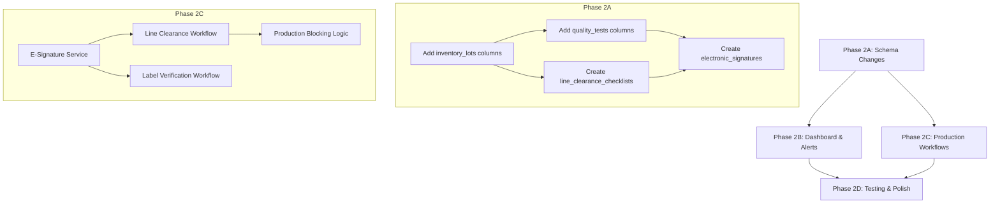

# Implementation Plan: GMP Compliance Gap Analysis - Phase 2 (External Auditor Requirements)

**Branch**: `009-gmp-compliance-gap-analysis` | **Date**: 2025-12-24 | **Spec**: [spec.md](./spec.md)
**Input**: Feature specification from `/specs/009-gmp-compliance-gap-analysis/spec.md`
**Phase**: 2 - External Auditor Gap Closure (FR-047 to FR-074)

## Summary

Phase 2 addresses 21 gaps identified from external auditor questions (docs/AUDIT-QUESTION-P1.md). These include:
- Dashboard KPIs for RM status, QC summary, production status
- Inventory detail fields (manufacturer, importer, retest date, documents)
- Production workflows (line clearance, label verification, BOM enhancements)
- Quality control improvements (disposition decisions, approval workflows)
- Electronic signature system for 21 CFR Part 11 alignment

**Total Effort**: 46 days estimated across 4 sub-phases.

## Technical Context

**Language/Version**: TypeScript 5.x with Next.js 14+
**Primary Dependencies**: Drizzle ORM, DevExtreme React 25.x, TanStack Query, Zod
**Storage**: MySQL (production), SQLite (testing) via Drizzle dual-schema
**Testing**: Vitest + React Testing Library for integration tests
**Target Platform**: Web application (desktop primary, tablet secondary)
**Project Type**: Full-stack web application (Next.js monolith)
**Performance Goals**: Dashboard loads <3s, API responses <500ms
**Constraints**: Must maintain backward compatibility with existing data
**Scale/Scope**: ~50 concurrent users, 10k+ lots, 100+ work orders/month

## Constitution Check

*GATE: Must pass before Phase 0 research. Re-check after Phase 1 design.*

| Principle | Requirement | Status | Notes |
|-----------|-------------|--------|-------|
| I. Type Safety | Strict TypeScript, no `any` | ✅ PASS | All new code will use Zod schemas |
| I. No Hardcoded Values | Config in env/database | ✅ PASS | Alert thresholds configurable |
| I. Reusable Components | Shared dialogs/forms | ✅ PASS | E-signature component reusable |
| II. Test Coverage | Unit + integration tests | ✅ PASS | Each feature tested with real SQLite |
| III. DevExtreme Only | No other UI libraries | ✅ PASS | All UI uses DevExtreme |
| IV. Performance | <3s page load, <500ms API | ✅ PASS | Dashboard uses optimized queries |
| V. Audit Trail | All changes logged | ✅ PASS | E-signatures provide enhanced audit |
| V. Data Integrity | Lot data immutable after QC | ✅ PASS | Disposition requires e-signature |

**Gate Status**: ✅ PASSED - No violations

## Project Structure

### Documentation (this feature)

```text
specs/009-gmp-compliance-gap-analysis/
├── spec.md              # Updated with FR-047 to FR-074
├── plan.md              # This file (Phase 2 plan)
├── research.md          # Updated with Phase 2 research
├── data-model.md        # Updated with new entities
├── quickstart.md        # Updated with Phase 2 guide
├── contracts/           # API contracts for new endpoints
└── tasks.md             # Phase 2 tasks (generated by /speckit.tasks)
```

### Source Code (repository root)

```text
src/
├── app/
│   ├── api/
│   │   ├── dashboard/
│   │   │   ├── audit-kpis/route.ts        # FR-047 to FR-054
│   │   │   └── rm-summary/route.ts        # FR-047
│   │   ├── inventory/
│   │   │   ├── min-stock-alerts/route.ts  # FR-050
│   │   │   └── lots/[id]/documents/route.ts  # FR-057
│   │   ├── production/
│   │   │   ├── line-clearance/route.ts    # FR-062
│   │   │   └── label-verification/route.ts  # FR-064/065
│   │   └── quality/
│   │       └── disposition/route.ts       # FR-067
│   ├── dashboard/
│   │   └── audit/page.tsx                 # Auditor dashboard UI
│   └── production/
│       ├── line-clearance/page.tsx        # Line clearance UI
│       └── label-verification/page.tsx    # Label verification UI
├── components/
│   ├── shared/
│   │   ├── electronic-signature-dialog.tsx  # FR-071
│   │   └── document-upload.tsx            # FR-057
│   ├── dashboard/
│   │   ├── rm-summary-card.tsx            # FR-047
│   │   ├── rm-status-card.tsx             # FR-048
│   │   ├── expiry-alert-card.tsx          # FR-049
│   │   ├── min-stock-alert-card.tsx       # FR-050
│   │   ├── qc-summary-card.tsx            # FR-051
│   │   ├── production-status-card.tsx     # FR-052
│   │   ├── pending-qc-card.tsx            # FR-053
│   │   └── fg-approved-card.tsx           # FR-054
│   └── production/
│       ├── line-clearance-form.tsx        # FR-062
│       └── label-verification-form.tsx    # FR-064/065
├── lib/
│   ├── db/
│   │   └── schema/
│   │       ├── sqlite/schema.ts           # Updated with new columns/tables
│   │       └── mysql/schema.ts            # Updated with new columns/tables
│   └── services/
│       ├── dashboard.service.ts           # Audit KPI calculations
│       ├── electronic-signature.service.ts  # FR-071 to FR-074
│       └── line-clearance.service.ts      # FR-062
└── types/
    ├── dashboard.ts                       # Dashboard KPI types
    └── electronic-signature.ts            # E-signature types

tests/
├── integration/
│   ├── services/
│   │   ├── dashboard-service-real.test.ts
│   │   ├── electronic-signature-service-real.test.ts
│   │   └── line-clearance-service-real.test.ts
│   └── api/
│       └── dashboard-audit-kpis.test.ts
└── helpers/
    └── seed-data.ts                       # Updated with Phase 2 seed data
```

**Structure Decision**: Extends existing Next.js monolith structure. New features follow established patterns from Phase 1 modules.

---

## Phase 2A: Schema Changes (Week 1-2)

### New Tables

| Table | Purpose | FR Reference |
|-------|---------|--------------|
| `line_clearance_checklists` | Pre-production verification | FR-062 |
| `label_verifications` | BMR label attachments | FR-064/065 |
| `electronic_signatures` | 21 CFR Part 11 signatures | FR-071-074 |
| `lot_documents` | COA/Spec/MSDS attachments | FR-057 |
| `stock_alert_rules` | Configurable alert thresholds | FR-050 |

### Column Additions

| Table | New Columns | FR Reference |
|-------|-------------|--------------|
| `inventory_lots` | manufacturerName, manufacturerId, importerName, importerId, countryOfOrigin, retestDate, retestInterval, retestStatus | FR-055, FR-056 |
| `items` | strength | FR-059 |
| `quality_tests` | disposition, dispositionBy, dispositionAt, dispositionReason, dispositionApprovedBy, dispositionApprovedAt | FR-067-070 |
| `bom_lines` | percentageInFormula, weighedQty, weighedBy, verifiedBy, verifiedAt | FR-063 |
| `work_orders` | lineClearanceRequired, lineClearanceStatus, lineClearanceBy, lineClearanceAt, lineClearanceChecklistId | FR-062 |

---

## Phase 2B: Dashboard & Alerts (Week 2-3)

### New API Endpoints

| Endpoint | Method | Purpose | FR Reference |
|----------|--------|---------|--------------|
| `/api/dashboard/audit-kpis` | GET | All 8 KPI cards for audit dashboard | FR-047-054 |
| `/api/dashboard/rm-summary` | GET | RM received YTD with frequency | FR-047 |
| `/api/inventory/min-stock-alerts` | GET | Items below reorder point | FR-050 |
| `/api/quality/qc-summary` | GET | Pass/fail counts with dispositions | FR-051 |
| `/api/production/status` | GET | Active work orders summary | FR-052 |
| `/api/quality/pending-release` | GET | FG awaiting QC approval | FR-053 |

### Dashboard Components

8 new KPI cards for the audit dashboard page at `/dashboard/audit`:
1. RM Received YTD (FR-047)
2. RM Status Breakdown (FR-048)
3. Expiry Alerts (FR-049)
4. Min Stock Alerts (FR-050)
5. QC Summary (FR-051)
6. Production Status (FR-052)
7. Pending QC Release (FR-053)
8. FG Approved (FR-054)

---

## Phase 2C: Production Workflows (Week 3-4)

### Line Clearance Workflow (FR-062)

**Flow**:
1. Work order released → Line clearance required
2. Operator completes checklist (previous product cleared, area clean, equipment clean)
3. Verifier reviews and signs (e-signature)
4. Line clearance approved → Production can start
5. System blocks production if line clearance not complete

### Label Verification Workflow (FR-064/065)

**Flow**:
1. Packaging step reached → Label verification required
2. Operator uploads label image
3. Operator signs (e-signature with meaning: "I verify this label is correct")
4. Witness countersigns (e-signature)
5. Label verification attached to batch record

### Electronic Signature System (FR-071-074)

**Components**:
- `ElectronicSignatureDialog` - Reusable modal for password re-auth
- `electronicSignatures` table - Stores signature records
- Signature hash generation using SHA-256
- Meaning statement capture ("I have performed...", "I verify...")

**Critical Operations Requiring E-Signature**:
- Line clearance verification
- Label verification (operator + witness)
- QC disposition approval
- Document approval
- CAPA effectiveness verification

---

## Phase 2D: Testing & Polish (Week 4-5)

### Integration Tests Required

| Test File | Coverage |
|-----------|----------|
| `dashboard-service-real.test.ts` | All 8 KPI calculations |
| `electronic-signature-service-real.test.ts` | Signature creation, verification, hash validation |
| `line-clearance-service-real.test.ts` | Checklist workflow, blocking logic |
| `label-verification-service-real.test.ts` | Image upload, dual signature |
| `qc-disposition-service-real.test.ts` | Disposition workflow, lot status update |

### UI Tests Required

| Test File | Coverage |
|-----------|----------|
| `audit-dashboard.test.tsx` | 8 KPI cards render correctly |
| `line-clearance-form.test.tsx` | Form validation, submission |
| `electronic-signature-dialog.test.tsx` | Password verification, error states |

---

## Dependencies & Execution Order



---

## Risk Mitigation

| Risk | Likelihood | Impact | Mitigation |
|------|------------|--------|------------|
| E-signature complexity | Medium | High | Start with simple password re-auth, defer PKI |
| Schema migration breaks production | Low | High | Test migrations on staging first |
| Dashboard performance with large data | Medium | Medium | Add indexes, use aggregation queries |
| Label image storage size | Low | Medium | Compress images, use S3 if needed |
| Dual signature UX complexity | Medium | Medium | Design intuitive operator/witness flow |

---

## Success Criteria Verification

| Criterion | Test Method |
|-----------|-------------|
| SC-011: Dashboard <3s | Performance test with 10k lots |
| SC-012: 100% manufacturer recorded | DB constraint + UI validation |
| SC-013: 100% retest dates tracked | DB constraint for materials with retest |
| SC-014: 100% lots have COA | Validation rule on lot creation |
| SC-015: 100% line clearance enforced | Integration test for production blocking |
| SC-016: 100% label verification | Integration test for packaging step |
| SC-017: 100% disposition on failed QC | DB constraint + workflow enforcement |
| SC-018: E-signatures with password | Unit test for signature service |

---

## Next Steps

1. Run `/speckit.tasks` to generate detailed tasks for Phase 2
2. Execute Phase 2A schema changes first
3. Deploy to staging for testing
4. Execute Phase 2B-2D in sequence
5. Run full integration test suite
6. Deploy to production

---

## References

- [spec.md](./spec.md) - Full specification with FR-047 to FR-074
- [research.md](./research.md) - Technical decisions and patterns
- [data-model.md](./data-model.md) - Entity definitions
- [docs/AUDIT-QUESTION-P1.md](/docs/AUDIT-QUESTION-P1.md) - Original auditor questions
