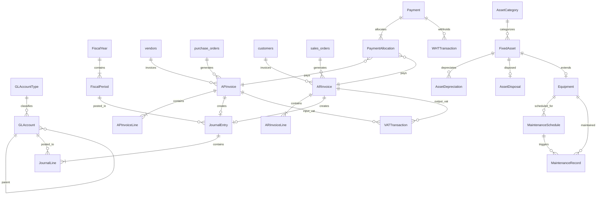

# Data Model: Accounting Module Integration

**Date**: 2025-12-25
**Feature**: 010-accounting-module-integration

## Entity Overview

| Entity | Purpose | Key Relationships |
|--------|---------|-------------------|
| GLAccount | Chart of Accounts | Parent account (hierarchy), Account Type |
| GLAccountType | Account classification | - |
| JournalEntry | Transaction header | Lines, Fiscal Period, Source document |
| JournalLine | Debit/Credit lines | GL Account |
| APInvoice | Vendor invoice | Vendor, PO, Lines, Payments |
| APInvoiceLine | AP line items | GL Account, Item |
| ARInvoice | Customer invoice | Customer, SO, Lines, Payments |
| ARInvoiceLine | AR line items | GL Account, Item |
| Payment | AP/AR payment | Invoice allocations, Bank account |
| PaymentAllocation | Payment to invoice mapping | Payment, Invoice |
| FiscalPeriod | Accounting period | Fiscal Year |
| FiscalYear | Year definition | Periods |
| VATTransaction | VAT register | Invoice |
| WHTTransaction | WHT record | Payment |
| FixedAsset | Asset register | Category, Equipment, Depreciation |
| AssetCategory | Asset classification | GL accounts |
| AssetDepreciation | Monthly depreciation | Asset, Period, Journal Entry |
| AssetDisposal | Disposal record | Asset, Journal Entry |
| Equipment | Manufacturing equipment | Fixed Asset, Maintenance |
| MaintenanceSchedule | Preventive plan | Equipment |
| MaintenanceRecord | Maintenance event | Equipment, Schedule |

---

## Core Accounting Entities

### GLAccountType

Classification for account types.

| Field | Type | Constraints | Description |
|-------|------|-------------|-------------|
| id | integer | PK, auto | Unique identifier |
| code | varchar(10) | UNIQUE, NOT NULL | Type code (e.g., "ASSET", "LIABILITY") |
| nameTh | varchar(100) | NOT NULL | Thai name |
| nameEn | varchar(100) | NOT NULL | English name |
| category | enum | NOT NULL | "asset", "liability", "equity", "revenue", "expense" |
| normalBalance | enum | NOT NULL | "debit", "credit" |
| displayOrder | integer | NOT NULL | Sort order for reports |
| createdAt | datetime | NOT NULL | Creation timestamp |
| updatedAt | datetime | NOT NULL | Last update timestamp |

**Sample Data**:
```
CASH       | เงินสดและรายการเทียบเท่าเงินสด | Cash and Cash Equivalents | asset   | debit  | 1
RECEIVABLE | ลูกหนี้การค้า                  | Trade Receivables         | asset   | debit  | 2
INVENTORY  | สินค้าคงเหลือ                  | Inventories               | asset   | debit  | 3
FIXED      | ที่ดินอาคารและอุปกรณ์          | Property, Plant & Equipment| asset   | debit  | 4
PAYABLE    | เจ้าหนี้การค้า                 | Trade Payables            | liability| credit | 5
ACCR_EXP   | ค่าใช้จ่ายค้างจ่าย             | Accrued Expenses          | liability| credit | 6
VAT_PAY    | ภาษีมูลค่าเพิ่มค้างจ่าย        | VAT Payable               | liability| credit | 7
EQUITY     | ส่วนของผู้ถือหุ้น              | Shareholders' Equity      | equity   | credit | 8
REVENUE    | รายได้                         | Revenue                   | revenue  | credit | 9
COGS       | ต้นทุนขาย                      | Cost of Goods Sold        | expense  | debit  | 10
OPEX       | ค่าใช้จ่ายในการดำเนินงาน       | Operating Expenses        | expense  | debit  | 11
```

---

### GLAccount

Chart of Accounts entry.

| Field | Type | Constraints | Description |
|-------|------|-------------|-------------|
| id | integer | PK, auto | Unique identifier |
| code | varchar(20) | UNIQUE, NOT NULL | Account code (e.g., "1100") |
| nameTh | varchar(200) | NOT NULL | Thai account name |
| nameEn | varchar(200) | NOT NULL | English account name |
| accountTypeId | integer | FK → GLAccountType | Account classification |
| parentId | integer | FK → GLAccount, NULL | Parent account for hierarchy |
| level | integer | NOT NULL | Hierarchy level (1=top) |
| isActive | boolean | DEFAULT true | Whether account is active |
| isPostable | boolean | DEFAULT true | Whether can post JE to this account |
| isBankAccount | boolean | DEFAULT false | Is this a bank account |
| bankName | varchar(100) | NULL | Bank name if bank account |
| bankAccountNumber | varchar(50) | NULL | Bank account number |
| description | text | NULL | Account description/notes |
| createdBy | integer | FK → users | Creator |
| createdAt | datetime | NOT NULL | Creation timestamp |
| updatedAt | datetime | NOT NULL | Last update timestamp |

**Indexes**: `code` (UNIQUE), `parentId`, `accountTypeId`, `isActive`

**Validation Rules**:
- Code must be 1-20 characters, alphanumeric
- Cannot deactivate account with non-zero balance
- Cannot delete account with posted transactions
- Parent must be at lower level (parent.level < child.level)

---

### JournalEntry

Journal entry header (transaction).

| Field | Type | Constraints | Description |
|-------|------|-------------|-------------|
| id | integer | PK, auto | Unique identifier |
| entryNumber | varchar(20) | UNIQUE, NOT NULL | JE number (auto-generated) |
| entryDate | date | NOT NULL | Transaction date |
| fiscalPeriodId | integer | FK → FiscalPeriod | Accounting period |
| description | text | NULL | Entry description |
| sourceType | enum | NULL | "PO_RECEIPT", "SO_SHIPMENT", "AP_PAYMENT", "AR_RECEIPT", "DEPRECIATION", "PAYROLL", "MANUAL" |
| sourceId | integer | NULL | Reference to source document |
| status | enum | NOT NULL | "draft", "posted", "reversed" |
| totalDebit | decimal(15,2) | NOT NULL | Sum of debit lines |
| totalCredit | decimal(15,2) | NOT NULL | Sum of credit lines |
| postedBy | integer | FK → users, NULL | User who posted |
| postedAt | datetime | NULL | Posting timestamp |
| reversedBy | integer | FK → users, NULL | User who reversed |
| reversedAt | datetime | NULL | Reversal timestamp |
| reversalEntryId | integer | FK → JournalEntry, NULL | Link to reversing entry |
| createdBy | integer | FK → users | Creator |
| createdAt | datetime | NOT NULL | Creation timestamp |
| updatedAt | datetime | NOT NULL | Last update timestamp |

**Indexes**: `entryNumber` (UNIQUE), `entryDate`, `fiscalPeriodId`, `status`, `sourceType + sourceId`

**Entry Number Format**: `JE-YYYYMM-NNNNNN` (e.g., JE-202512-000001)

**State Transitions**:
```
draft → posted (on approval)
posted → reversed (creates new reversing JE)
```

**Validation Rules**:
- totalDebit must equal totalCredit
- Cannot post to closed period
- Cannot modify posted entry (create reversal instead)

---

### JournalLine

Individual debit or credit line within a journal entry.

| Field | Type | Constraints | Description |
|-------|------|-------------|-------------|
| id | integer | PK, auto | Unique identifier |
| journalEntryId | integer | FK → JournalEntry, NOT NULL | Parent entry |
| lineNumber | integer | NOT NULL | Line sequence |
| glAccountId | integer | FK → GLAccount, NOT NULL | Account to post to |
| debit | decimal(15,2) | DEFAULT 0 | Debit amount |
| credit | decimal(15,2) | DEFAULT 0 | Credit amount |
| description | text | NULL | Line description |
| costCenterId | integer | FK → cost_centers, NULL | Cost center allocation |
| createdAt | datetime | NOT NULL | Creation timestamp |

**Indexes**: `journalEntryId`, `glAccountId`

**Validation Rules**:
- Either debit or credit must be positive, not both
- Account must be postable (isPostable = true)
- Account must be active

---

## Accounts Payable Entities

### APInvoice

Vendor invoice (accounts payable).

| Field | Type | Constraints | Description |
|-------|------|-------------|-------------|
| id | integer | PK, auto | Unique identifier |
| invoiceNumber | varchar(50) | UNIQUE, NOT NULL | Vendor invoice number |
| vendorId | integer | FK → vendors, NOT NULL | Vendor reference |
| purchaseOrderId | integer | FK → purchase_orders, NULL | Source PO |
| invoiceDate | date | NOT NULL | Invoice date |
| dueDate | date | NOT NULL | Payment due date |
| receivedDate | date | NOT NULL | Date received from vendor |
| description | text | NULL | Invoice description |
| subtotal | decimal(15,2) | NOT NULL | Amount before VAT |
| vatAmount | decimal(15,2) | DEFAULT 0 | VAT amount (7%) |
| whtAmount | decimal(15,2) | DEFAULT 0 | Withholding tax amount |
| totalAmount | decimal(15,2) | NOT NULL | Total including VAT |
| paidAmount | decimal(15,2) | DEFAULT 0 | Amount paid so far |
| currency | varchar(3) | DEFAULT 'THB' | Currency code |
| exchangeRate | decimal(10,6) | DEFAULT 1 | Exchange rate to THB |
| status | enum | NOT NULL | "draft", "approved", "posted", "partial", "paid", "cancelled" |
| approvedBy | integer | FK → users, NULL | Approver |
| approvedAt | datetime | NULL | Approval timestamp |
| journalEntryId | integer | FK → JournalEntry, NULL | Linked JE when posted |
| createdBy | integer | FK → users | Creator |
| createdAt | datetime | NOT NULL | Creation timestamp |
| updatedAt | datetime | NOT NULL | Last update timestamp |

**Indexes**: `invoiceNumber` (UNIQUE), `vendorId`, `purchaseOrderId`, `status`, `dueDate`

**State Transitions**:
```
draft → approved → posted → partial → paid
                         ↘ cancelled (creates reversal if posted)
```

---

### APInvoiceLine

AP invoice line items.

| Field | Type | Constraints | Description |
|-------|------|-------------|-------------|
| id | integer | PK, auto | Unique identifier |
| apInvoiceId | integer | FK → APInvoice, NOT NULL | Parent invoice |
| lineNumber | integer | NOT NULL | Line sequence |
| description | text | NOT NULL | Line description |
| itemId | integer | FK → items, NULL | Inventory item (if applicable) |
| glAccountId | integer | FK → GLAccount, NOT NULL | Expense/asset account |
| quantity | decimal(15,4) | DEFAULT 1 | Quantity |
| unitPrice | decimal(15,4) | NOT NULL | Price per unit |
| amount | decimal(15,2) | NOT NULL | Line amount (qty × price) |
| vatAmount | decimal(15,2) | DEFAULT 0 | VAT for this line |
| isCapitalizable | boolean | DEFAULT false | Eligible for fixed asset |
| createdAt | datetime | NOT NULL | Creation timestamp |

---

## Accounts Receivable Entities

### ARInvoice

Customer invoice (accounts receivable).

| Field | Type | Constraints | Description |
|-------|------|-------------|-------------|
| id | integer | PK, auto | Unique identifier |
| invoiceNumber | varchar(50) | UNIQUE, NOT NULL | Internal invoice number |
| taxInvoiceNumber | varchar(50) | UNIQUE, NOT NULL | Thai tax invoice number |
| customerId | integer | FK → customers, NOT NULL | Customer reference |
| salesOrderId | integer | FK → sales_orders, NULL | Source SO |
| invoiceDate | date | NOT NULL | Invoice date |
| dueDate | date | NOT NULL | Payment due date |
| description | text | NULL | Invoice description |
| subtotal | decimal(15,2) | NOT NULL | Amount before VAT |
| vatAmount | decimal(15,2) | DEFAULT 0 | VAT amount (7%) |
| totalAmount | decimal(15,2) | NOT NULL | Total including VAT |
| paidAmount | decimal(15,2) | DEFAULT 0 | Amount received so far |
| currency | varchar(3) | DEFAULT 'THB' | Currency code |
| exchangeRate | decimal(10,6) | DEFAULT 1 | Exchange rate to THB |
| status | enum | NOT NULL | "draft", "confirmed", "posted", "partial", "paid", "cancelled" |
| confirmedBy | integer | FK → users, NULL | Confirmer |
| confirmedAt | datetime | NULL | Confirmation timestamp |
| journalEntryId | integer | FK → JournalEntry, NULL | Linked JE when posted |
| createdBy | integer | FK → users | Creator |
| createdAt | datetime | NOT NULL | Creation timestamp |
| updatedAt | datetime | NOT NULL | Last update timestamp |

**Tax Invoice Number Format**: `TTTTTT-BBBBB-YYYYMM-NNNNNN`

---

### ARInvoiceLine

AR invoice line items.

| Field | Type | Constraints | Description |
|-------|------|-------------|-------------|
| id | integer | PK, auto | Unique identifier |
| arInvoiceId | integer | FK → ARInvoice, NOT NULL | Parent invoice |
| lineNumber | integer | NOT NULL | Line sequence |
| description | text | NOT NULL | Line description |
| itemId | integer | FK → items, NULL | Inventory item |
| glAccountId | integer | FK → GLAccount, NOT NULL | Revenue account |
| quantity | decimal(15,4) | DEFAULT 1 | Quantity |
| unitPrice | decimal(15,4) | NOT NULL | Price per unit |
| amount | decimal(15,2) | NOT NULL | Line amount |
| vatAmount | decimal(15,2) | DEFAULT 0 | VAT for this line |
| lotId | integer | FK → inventory_lots, NULL | Lot shipped (for COGS) |
| createdAt | datetime | NOT NULL | Creation timestamp |

---

## Payment Entities

### Payment

Payment record for AP or AR.

| Field | Type | Constraints | Description |
|-------|------|-------------|-------------|
| id | integer | PK, auto | Unique identifier |
| paymentNumber | varchar(20) | UNIQUE, NOT NULL | Payment reference |
| paymentType | enum | NOT NULL | "ap" (outgoing), "ar" (incoming) |
| paymentDate | date | NOT NULL | Payment date |
| vendorId | integer | FK → vendors, NULL | For AP payments |
| customerId | integer | FK → customers, NULL | For AR payments |
| bankAccountId | integer | FK → GLAccount, NOT NULL | Bank/cash account |
| paymentMethod | enum | NOT NULL | "cash", "check", "transfer", "other" |
| referenceNumber | varchar(50) | NULL | Check number / transfer ref |
| amount | decimal(15,2) | NOT NULL | Payment amount |
| whtAmount | decimal(15,2) | DEFAULT 0 | WHT deducted (AP only) |
| description | text | NULL | Payment notes |
| status | enum | NOT NULL | "pending", "completed", "cancelled" |
| journalEntryId | integer | FK → JournalEntry, NULL | Linked JE |
| createdBy | integer | FK → users | Creator |
| createdAt | datetime | NOT NULL | Creation timestamp |
| updatedAt | datetime | NOT NULL | Last update timestamp |

**Payment Number Format**: `PAY-YYYYMM-NNNNNN`

---

### PaymentAllocation

Links payments to invoices.

| Field | Type | Constraints | Description |
|-------|------|-------------|-------------|
| id | integer | PK, auto | Unique identifier |
| paymentId | integer | FK → Payment, NOT NULL | Payment reference |
| apInvoiceId | integer | FK → APInvoice, NULL | AP invoice (if AP payment) |
| arInvoiceId | integer | FK → ARInvoice, NULL | AR invoice (if AR payment) |
| allocatedAmount | decimal(15,2) | NOT NULL | Amount allocated to invoice |
| createdAt | datetime | NOT NULL | Creation timestamp |

---

## Fiscal Period Entities

### FiscalYear

Fiscal year definition.

| Field | Type | Constraints | Description |
|-------|------|-------------|-------------|
| id | integer | PK, auto | Unique identifier |
| yearCode | varchar(10) | UNIQUE, NOT NULL | Year code (e.g., "2025") |
| startDate | date | NOT NULL | Year start date |
| endDate | date | NOT NULL | Year end date |
| isCurrent | boolean | DEFAULT false | Is current fiscal year |
| status | enum | NOT NULL | "open", "closed" |
| closedBy | integer | FK → users, NULL | Who closed the year |
| closedAt | datetime | NULL | When year was closed |
| createdAt | datetime | NOT NULL | Creation timestamp |
| updatedAt | datetime | NOT NULL | Last update timestamp |

---

### FiscalPeriod

Monthly accounting period.

| Field | Type | Constraints | Description |
|-------|------|-------------|-------------|
| id | integer | PK, auto | Unique identifier |
| fiscalYearId | integer | FK → FiscalYear, NOT NULL | Parent year |
| periodNumber | integer | NOT NULL | 1-12 (or 1-13 for adjustment) |
| periodName | varchar(20) | NOT NULL | "January 2025" etc. |
| startDate | date | NOT NULL | Period start |
| endDate | date | NOT NULL | Period end |
| status | enum | NOT NULL | "open", "soft_closed", "closed" |
| closedBy | integer | FK → users, NULL | Who closed |
| closedAt | datetime | NULL | When closed |
| createdAt | datetime | NOT NULL | Creation timestamp |
| updatedAt | datetime | NOT NULL | Last update timestamp |

---

## Tax Entities

### VATTransaction

VAT register for Por Por 30 filing.

| Field | Type | Constraints | Description |
|-------|------|-------------|-------------|
| id | integer | PK, auto | Unique identifier |
| transactionType | enum | NOT NULL | "input" (purchases), "output" (sales) |
| taxInvoiceNumber | varchar(50) | NOT NULL | Tax invoice number |
| taxInvoiceDate | date | NOT NULL | Tax invoice date |
| taxPeriod | varchar(7) | NOT NULL | YYYY-MM format |
| vendorId | integer | FK → vendors, NULL | Vendor (if input) |
| customerId | integer | FK → customers, NULL | Customer (if output) |
| partyName | varchar(200) | NOT NULL | Vendor/customer name |
| partyTaxId | varchar(20) | NOT NULL | Tax ID of party |
| branchCode | varchar(5) | DEFAULT '00000' | Branch code |
| taxableAmount | decimal(15,2) | NOT NULL | Amount before VAT |
| vatRate | decimal(5,2) | NOT NULL | VAT rate (7.00) |
| vatAmount | decimal(15,2) | NOT NULL | VAT amount |
| totalAmount | decimal(15,2) | NOT NULL | Total with VAT |
| apInvoiceId | integer | FK → APInvoice, NULL | Source AP invoice |
| arInvoiceId | integer | FK → ARInvoice, NULL | Source AR invoice |
| createdAt | datetime | NOT NULL | Creation timestamp |

---

### WHTTransaction

Withholding tax record.

| Field | Type | Constraints | Description |
|-------|------|-------------|-------------|
| id | integer | PK, auto | Unique identifier |
| certificateNumber | varchar(20) | UNIQUE, NOT NULL | WHT certificate number |
| certificateType | enum | NOT NULL | "pnd3" (individual), "pnd53" (company) |
| paymentId | integer | FK → Payment, NOT NULL | Source payment |
| vendorId | integer | FK → vendors, NOT NULL | Vendor/payee |
| paymentDate | date | NOT NULL | Payment date |
| taxPeriod | varchar(7) | NOT NULL | YYYY-MM format |
| whtType | varchar(20) | NOT NULL | WHT type code (40(4), 40(6), etc.) |
| whtDescription | varchar(200) | NOT NULL | Description of income type |
| paymentAmount | decimal(15,2) | NOT NULL | Amount before WHT |
| whtRate | decimal(5,2) | NOT NULL | WHT rate percentage |
| whtAmount | decimal(15,2) | NOT NULL | WHT amount |
| netAmount | decimal(15,2) | NOT NULL | Amount after WHT |
| createdAt | datetime | NOT NULL | Creation timestamp |

**Certificate Number Format**: `WHT-YYYYMM-NNNNNN`

---

## Fixed Asset Entities

### AssetCategory

Fixed asset classification.

| Field | Type | Constraints | Description |
|-------|------|-------------|-------------|
| id | integer | PK, auto | Unique identifier |
| code | varchar(20) | UNIQUE, NOT NULL | Category code |
| nameTh | varchar(100) | NOT NULL | Thai name |
| nameEn | varchar(100) | NOT NULL | English name |
| defaultUsefulLifeMonths | integer | NOT NULL | Default useful life |
| defaultDepreciationMethod | enum | NOT NULL | "straight_line", "declining_balance" |
| maxDepreciationRate | decimal(5,2) | NOT NULL | Thai Revenue Code max rate |
| assetGLAccountId | integer | FK → GLAccount, NOT NULL | Asset account |
| depreciationExpenseGLAccountId | integer | FK → GLAccount, NOT NULL | Expense account |
| accumulatedDepreciationGLAccountId | integer | FK → GLAccount, NOT NULL | Contra-asset account |
| isActive | boolean | DEFAULT true | Whether category is active |
| createdAt | datetime | NOT NULL | Creation timestamp |
| updatedAt | datetime | NOT NULL | Last update timestamp |

---

### FixedAsset

Fixed asset register.

| Field | Type | Constraints | Description |
|-------|------|-------------|-------------|
| id | integer | PK, auto | Unique identifier |
| assetCode | varchar(30) | UNIQUE, NOT NULL | Asset tag/code |
| nameTh | varchar(200) | NOT NULL | Thai description |
| nameEn | varchar(200) | NOT NULL | English description |
| categoryId | integer | FK → AssetCategory, NOT NULL | Asset category |
| acquisitionDate | date | NOT NULL | Date acquired |
| acquisitionCost | decimal(15,2) | NOT NULL | Original cost |
| salvageValue | decimal(15,2) | DEFAULT 0 | Residual value |
| usefulLifeMonths | integer | NOT NULL | Useful life in months |
| depreciationMethod | enum | NOT NULL | "straight_line", "declining_balance" |
| depreciationStartDate | date | NOT NULL | When depreciation begins |
| accumulatedDepreciation | decimal(15,2) | DEFAULT 0 | Total depreciation to date |
| netBookValue | decimal(15,2) | NOT NULL | Current book value |
| location | varchar(100) | NULL | Physical location |
| departmentId | integer | FK → hr_org_units, NULL | Responsible department |
| responsiblePersonId | integer | FK → hr_employees, NULL | Custodian |
| purchaseOrderId | integer | FK → purchase_orders, NULL | Source PO |
| apInvoiceId | integer | FK → ap_invoices, NULL | Source invoice |
| status | enum | NOT NULL | "active", "disposed", "fully_depreciated" |
| disposalDate | date | NULL | Date disposed |
| createdBy | integer | FK → users | Creator |
| createdAt | datetime | NOT NULL | Creation timestamp |
| updatedAt | datetime | NOT NULL | Last update timestamp |

**Asset Code Format**: `FA-CAT-NNNNNN` (e.g., FA-MACH-000001)

---

### AssetDepreciation

Monthly depreciation record.

| Field | Type | Constraints | Description |
|-------|------|-------------|-------------|
| id | integer | PK, auto | Unique identifier |
| fixedAssetId | integer | FK → FixedAsset, NOT NULL | Asset reference |
| fiscalPeriodId | integer | FK → FiscalPeriod, NOT NULL | Accounting period |
| depreciationDate | date | NOT NULL | Depreciation date |
| openingBookValue | decimal(15,2) | NOT NULL | Book value at start |
| depreciationAmount | decimal(15,2) | NOT NULL | This period's depreciation |
| accumulatedDepreciation | decimal(15,2) | NOT NULL | Total accumulated |
| closingBookValue | decimal(15,2) | NOT NULL | Book value after |
| journalEntryId | integer | FK → JournalEntry, NULL | Linked JE |
| createdAt | datetime | NOT NULL | Creation timestamp |

---

### AssetDisposal

Asset disposal record.

| Field | Type | Constraints | Description |
|-------|------|-------------|-------------|
| id | integer | PK, auto | Unique identifier |
| fixedAssetId | integer | FK → FixedAsset, NOT NULL | Asset disposed |
| disposalDate | date | NOT NULL | Disposal date |
| disposalType | enum | NOT NULL | "sale", "write_off", "scrap", "transfer" |
| disposalReason | text | NULL | Reason for disposal |
| saleProceeds | decimal(15,2) | DEFAULT 0 | Amount received (if sold) |
| bookValueAtDisposal | decimal(15,2) | NOT NULL | NBV at disposal |
| gainLoss | decimal(15,2) | NOT NULL | Gain/(Loss) on disposal |
| buyerName | varchar(200) | NULL | Buyer (if sold) |
| journalEntryId | integer | FK → JournalEntry, NULL | Linked JE |
| approvedBy | integer | FK → users, NULL | Approver |
| approvedAt | datetime | NULL | Approval timestamp |
| createdBy | integer | FK → users | Creator |
| createdAt | datetime | NOT NULL | Creation timestamp |

---

## Equipment & Maintenance Entities

### Equipment

Manufacturing equipment (extends FixedAsset).

| Field | Type | Constraints | Description |
|-------|------|-------------|-------------|
| id | integer | PK, auto | Unique identifier |
| fixedAssetId | integer | FK → FixedAsset, UNIQUE, NOT NULL | Base asset |
| serialNumber | varchar(100) | NULL | Serial number |
| manufacturer | varchar(100) | NULL | Manufacturer name |
| model | varchar(100) | NULL | Model number |
| specifications | text | NULL | Technical specs |
| warrantyStartDate | date | NULL | Warranty start |
| warrantyEndDate | date | NULL | Warranty end |
| operatingHours | decimal(10,2) | DEFAULT 0 | Total operating hours |
| operatingUnits | decimal(15,2) | DEFAULT 0 | Total units produced |
| lastMeterReading | decimal(10,2) | DEFAULT 0 | Last hour meter reading |
| lastMeterReadingDate | date | NULL | When meter was read |
| assignedOperatorId | integer | FK → hr_employees, NULL | Primary operator |
| productionLineId | integer | FK → production_lines, NULL | Production line |
| isAvailable | boolean | DEFAULT true | Available for use |
| lastMaintenanceDate | date | NULL | Last maintenance |
| nextMaintenanceDue | date | NULL | Next scheduled maintenance |
| createdAt | datetime | NOT NULL | Creation timestamp |
| updatedAt | datetime | NOT NULL | Last update timestamp |

---

### MaintenanceSchedule

Preventive maintenance plan.

| Field | Type | Constraints | Description |
|-------|------|-------------|-------------|
| id | integer | PK, auto | Unique identifier |
| equipmentId | integer | FK → Equipment, NOT NULL | Equipment reference |
| maintenanceType | varchar(100) | NOT NULL | Type of maintenance |
| description | text | NULL | What to do |
| intervalType | enum | NOT NULL | "days", "weeks", "months", "hours", "units" |
| intervalValue | integer | NOT NULL | Interval amount |
| lastPerformed | date | NULL | Last performed date |
| lastPerformedHours | decimal(10,2) | NULL | Hours at last maintenance |
| nextDue | date | NOT NULL | Next due date |
| nextDueHours | decimal(10,2) | NULL | Next due hours (if hours-based) |
| alertDaysBefore | integer | DEFAULT 7 | Days before to alert |
| isActive | boolean | DEFAULT true | Whether schedule is active |
| createdBy | integer | FK → users | Creator |
| createdAt | datetime | NOT NULL | Creation timestamp |
| updatedAt | datetime | NOT NULL | Last update timestamp |

---

### MaintenanceRecord

Individual maintenance event.

| Field | Type | Constraints | Description |
|-------|------|-------------|-------------|
| id | integer | PK, auto | Unique identifier |
| equipmentId | integer | FK → Equipment, NOT NULL | Equipment reference |
| maintenanceScheduleId | integer | FK → MaintenanceSchedule, NULL | Scheduled maintenance (if applicable) |
| maintenanceDate | date | NOT NULL | When performed |
| maintenanceType | enum | NOT NULL | "preventive", "corrective", "emergency" |
| description | text | NOT NULL | Work performed |
| hoursAtMaintenance | decimal(10,2) | NULL | Hour meter reading |
| partsUsed | text | NULL | Parts used (JSON array) |
| partsCost | decimal(15,2) | DEFAULT 0 | Cost of parts |
| laborHours | decimal(5,2) | DEFAULT 0 | Labor hours |
| laborCost | decimal(15,2) | DEFAULT 0 | Labor cost |
| externalServiceCost | decimal(15,2) | DEFAULT 0 | External contractor cost |
| totalCost | decimal(15,2) | NOT NULL | Total maintenance cost |
| downtimeHours | decimal(5,2) | DEFAULT 0 | Equipment downtime |
| isCritical | boolean | DEFAULT false | Was this a critical failure |
| rootCause | text | NULL | Root cause (for corrective/emergency) |
| isCapitalized | boolean | DEFAULT false | Whether cost was capitalized |
| journalEntryId | integer | FK → JournalEntry, NULL | Expense/capitalize JE |
| performedBy | varchar(100) | NULL | Who performed (internal/external) |
| approvedBy | integer | FK → users, NULL | Approver |
| createdBy | integer | FK → users | Creator |
| createdAt | datetime | NOT NULL | Creation timestamp |
| updatedAt | datetime | NOT NULL | Last update timestamp |

---

## Entity Relationship Diagram (Mermaid)



---

## Data Model Complete

All 21 entities defined with:
- Field specifications
- Relationships
- Indexes
- Validation rules
- State transitions where applicable

**Next**: Generate API contracts in `/contracts/`
